# 🧠 Smart MCP
**AI-Powered Model Context Protocol Implementation with Intelligent Tool Integration**


> **Next-Generation AI Assistant Platform** - Seamlessly connect AI models with intelligent query parsing, real-time web search, location services, email automation, and advanced reasoning capabilities in one unified ecosystem.

---

## 🚀 **Live Demo & Screenshots**

### **Streamlit Web Interface**
Experience Smart MCP through our intuitive web interface with real-time tool execution and smart query analysis.


*Interactive web interface showing available tools and initial query processing*


*Real-time query analysis with tool selection and parameter extraction*


*GeoWhisper tool providing location-based recommendations with detailed place information*


*InsightScope delivering comprehensive weather analysis with real-time alerts and forecasts*


*Email automation showing query processing and successful message delivery*


*Confirmation of successful email operations with user-friendly feedback*

### **Command Line Interface**
For developers and power users who prefer terminal-based interactions.


---

## ⚡ **Key Features**

| Feature | Description | Status |
|---------|-------------|---------|
| 🔍 **InsightScope** | Real-time web analysis with GPT-4o browsing | ✅ Active |
| 🧠 **Reasoning Agent** | Advanced multi-source research and synthesis | ✅ Active |
| 🌍 **GeoWhisper** | Location intelligence via Google Places API | ✅ Active |
| 📧 **Gmail Integration** | Send, search, and manage emails intelligently | ✅ Active |
| 📅 **Smart Scheduling** | Google Calendar meeting management | ✅ Active |
| ⚡ **QuickClarity** | Fast responses for everyday queries | ✅ Active |
| 📝 **CoreBrief** | Professional document summarization | ✅ Active |
| 🎯 **Dynamic Tool Discovery** | Auto-detection of available MCP tools | ✅ Active |
| 🔄 **Real-time Communication** | Server-Sent Events for responsive UX | ✅ Active |
| 📚 **RAG Integration** | Retrieval-Augmented Generation | 🚧 Coming Soon |

---

## 🏗️ **Architecture Overview**

```mermaid
graph TB
    User[👤 User Query] --> Parser[🤖 OpenAI GPT-4 Query Parser]
    Parser --> Router{🎯 Intent Router}
    
    Router -->|Web Search| Insight[🔍 InsightScope]
    Router -->|Location| Geo[🌍 GeoWhisper] 
    Router -->|Email| Gmail[📧 Gmail Tools]
    Router -->|Schedule| Cal[📅 Calendar]
    Router -->|Reasoning| Reason[🧠 Reasoning Agent]
    Router -->|Quick Query| Quick[⚡ QuickClarity]
    Router -->|Summarize| Brief[📝 CoreBrief]
    
    Insight --> MCP[⚙️ MCP Server]
    Geo --> MCP
    Gmail --> MCP
    Cal --> MCP
    Reason --> MCP
    Quick --> MCP
    Brief --> MCP
    
    MCP --> Response[📤 Intelligent Response]
    Response --> UI1[🌐 Streamlit Interface]
    Response --> UI2[💻 CLI Interface]
```



---

## 🚀 **Quick Start**

### **Prerequisites**
- Python 3.12 or higher
- OpenAI API key
- Google Cloud credentials (for location & email services)
- 4GB+ RAM recommended

### **Installation**

```bash
# Clone the repository
git clone https://github.com/yourusername/smart-mcp.git
cd smart-mcp

# Install dependencies
pip install -r requirements.txt

# Setup environment variables
cp .env.example .env
# Edit .env with your API keys

# Start MCP server
python server.py &

# Launch your preferred interface
python streamlit_client.py  # Web interface
# OR
python cli_client.py        # Command line interface
```

### **Environment Setup**
```env
# Required
OPENAI_API_KEY=your_openai_api_key_here
MCP_HOST=0.0.0.0
MCP_PORT=8000

# Optional (for enhanced features)
GOOGLE_API_KEY=your_google_api_key
GOOGLE_PLACES_API_KEY=your_places_api_key
GMAIL_CREDENTIALS_PATH=path/to/gmail/credentials.json
```

---

## 🛠️ **Available Tools**

### **1. 🔍 InsightScope - Real-Time Web Analysis**
Advanced web research powered by GPT-4o with browsing capabilities.

```python
# Example usage
insight_scope("Latest developments in quantum computing 2024")
```

**Features:**
- Context-aware web search tailored to queries
- Real-time data extraction from authoritative sources
- Summarized insights with clickable source links
- Perfect for market research, trend analysis, verification

### **2. 🧠 Reasoning Agent - Advanced Research Assistant**
Multi-source research combining web search, knowledge synthesis, and structured analysis.

```python
# Example usage  
reasoning_agent("Compare renewable energy adoption rates across G7 countries")
```

**Capabilities:**
- Multi-source research via web, databases, documents
- Intelligent information synthesis and fact-checking
- Context adaptation for complex queries
- Comparative analysis and trend evaluation

### **3. 🌍 GeoWhisper - Location Intelligence**
Conversational location services powered by Google Places API.

```python
# Example usage
geo_whisper("Best vegetarian restaurants near Times Square with outdoor seating")
```

**Features:**
- Natural language place search
- Structured details: ratings, hours, contact info
- Travel planning and local exploration support
- Real-time business information

### **4. 📧 Gmail Integration Suite**
Complete email management with intelligent automation.

```python
# Send email
gmail_send("john@example.com", "Meeting Reminder", "Don't forget our 3PM call!")

# Search emails
gmail_search("from:boss@company.com subject:urgent")

# Create draft
gmail_draft("team@company.com", "Weekly Update", "This week's accomplishments...")
```

### **5. 📅 Smart Scheduling**
Google Calendar integration for intelligent meeting management.

```python
# Schedule meeting
schedule_meeting("2024-09-15", "14:00", "15:00", "colleague@company.com")

# List upcoming meetings
list_meetings()
```

---

## 💻 **Client Interfaces**

### **🌐 Streamlit Web Interface**
Perfect for interactive exploration and visual feedback.

**Features:**
- Real-time tool execution visualization
- Interactive query input with suggestions
- Rich response formatting with syntax highlighting
- Tool documentation sidebar
- Response history and export options

**Launch:**
```bash
streamlit run client_ui.py
```

### **💻 Command Line Interface**
Optimized for developers, automation, and power users.

```bash
python mcp_client.py
**Features:**
- Fast terminal-based interactions
- Scriptable commands for automation
- Colored output and progress indicators
- Command history and shortcuts
- Batch processing capabilities

**Launch:**
```bash
python mcp_client.py
```


---

## 🔧 **Advanced Configuration**

### **Custom Tool Development**
Extend Smart MCP with your own specialized tools:

```python
@mcp.tool()
def custom_analyzer(data: str, analysis_type: str) -> str:
    """
    Custom analysis tool for domain-specific processing.
    
    Args:
        data: Input data to analyze
        analysis_type: Type of analysis to perform
        
    Returns:
        Structured analysis results
    """
    # Your custom logic here
    return analysis_results
```

### **Query Parser Customization**
Fine-tune the AI query parsing for domain-specific needs:

```python
# Modify the system prompt in parse_query_with_ai()
CUSTOM_PROMPT = """
You are a specialized assistant for [YOUR_DOMAIN].
Parse queries with focus on [SPECIFIC_REQUIREMENTS]...
"""
```

### **API Integration**
Connect additional services and APIs:

```python
# Add new service integrations
from service.custom_service import CustomService

custom_service = CustomService(api_key="your_key")

@mcp.tool()
def custom_integration(query: str):
    return custom_service.process(query)
```

---

## 🔍 **Troubleshooting**

### **Common Issues**

**🔴 Connection Error to MCP Server**
```bash
Error: Connection refused on localhost:8000
```
**Solution:** Ensure MCP server is running: `python server.py`

**🔴 OpenAI API Key Error**
```bash  
Error: Invalid API key provided
```
**Solution:** Verify your `.env` file and API key validity

**🔴 Google Services Authentication**
```bash
Error: Google API authentication failed
```
**Solution:** Check credentials.json path and permissions

## 🤝 **Contributing**

We welcome contributions from the community! Here's how to get involved:

### **Development Setup**
```bash
# Fork and clone the repository
git clone https://github.com/PrimeRoxy/smart-mcp.git

# Create development environment
python -m venv venv
source venv/bin/activate  # Windows: venv\Scripts\activate

# Install development dependencies
pip install -r requirements-dev.txt

# Run pre-commit hooks
pre-commit install
```

### **Contribution Guidelines**
1. **Fork** the project
2. **Create** your feature branch (`git checkout -b feature/AmazingFeature`)
3. **Write** tests for your changes
4. **Ensure** all tests pass (`pytest`)
5. **Commit** your changes (`git commit -m 'Add AmazingFeature'`)
6. **Push** to the branch (`git push origin feature/AmazingFeature`)
7. **Open** a Pull Request

---

## 📊 **Community & Support**

### **Getting Help**
- 📚 **Documentation**: [Wiki Pages](https://github.com/PrimeRoxy/Smart-MCP/blob/main/README.md)
- 🐛 **Issues**: [Bug Reports](https://github.com/PrimeRoxy/smart-mcp/issues)
- 📧 **Direct Contact**: Vipuldashingboy@gmail.com


### **Third-Party Licenses**
- OpenAI API: [OpenAI Terms of Use](https://openai.com/terms/)
- Google APIs: [Google API Terms](https://developers.google.com/terms/)
- FastMCP: [Anthropic MCP License](https://github.com/anthropic/mcp)

---

## 🙏 **Acknowledgments**

Special thanks to the following projects and communities:

- **[Anthropic MCP](https://github.com/anthropic/mcp)** - For the foundational Model Context Protocol
- **[OpenAI](https://openai.com/)** - For providing the intelligent query parsing capabilities
- **[FastAPI](https://fastapi.tiangolo.com/)** - For the high-performance web framework
- **[Streamlit](https://streamlit.io/)** - For the amazing web interface framework
- **Open Source Community** - For continuous inspiration and support

---

## 📞 **Connect With Us**

<div align="center">

[](mailto:Vipuldashingboy@gmail.com)
[](https://linkedin.com/in/ismart-vipulray)
[](https://github.com/PrimeRoxy)

**⭐ If Smart MCP helped you build something amazing, please give it a star! ⭐**

---

*Built with ❤️ by developers, for developers*

</div>